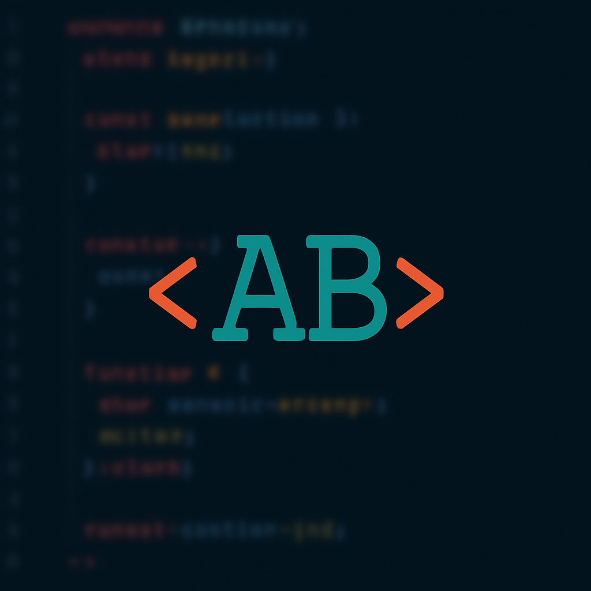

<head>
  <link rel="stylesheet" href="style.css">
</head>
<body>
  

    <h1>🛡️ CodeAvengers</h1>
    

      
    

    <h2>🚀 Meet the CodeAvengers</h2>
    
"Avengers, git commit!"

    

    <h3>Team Values</h3>
    <ul class="values">
      <li>🛡️ Collaboration</li>
      <li>⚡ Innovation</li>
      <li>🔥 Resilience</li>
      <li>🎉 Fun</li>
    </ul>

    

    <h2>🧑‍💻 Team Members</h2>

    

      
Andrew

      
(Andrew's bio goes here.)

    

    <!-- Repeat for other members -->

    

    <h2>🌟 Gallery</h2>
    

      
      
    

    

      Built with ❤️ by CodeAvengers
    

  

</body>

